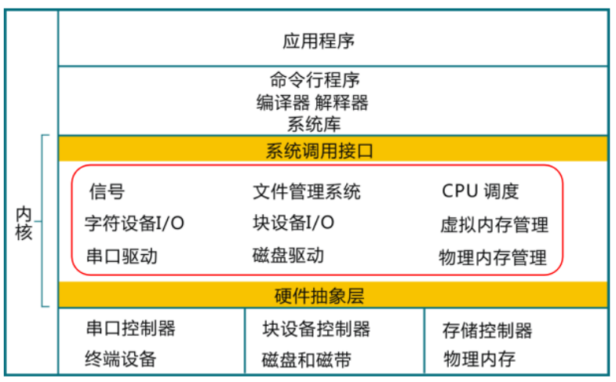
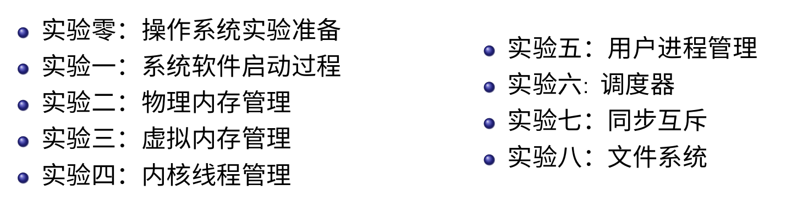
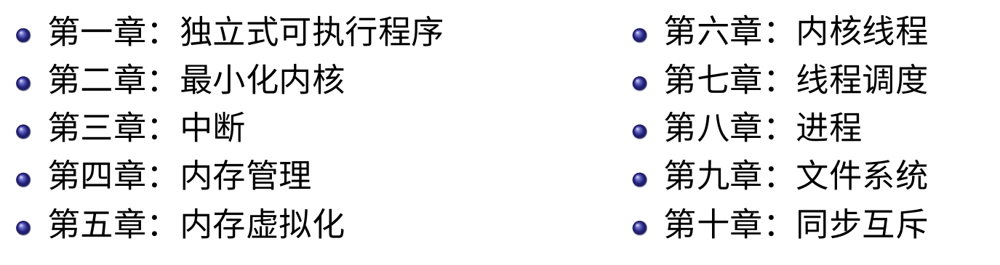

## 预备知识：

+ 程序设计语言：汇编，C和Rust

+ 数据结构：理解基本数据结构即可

+ 计算机组成原理：
  + 陈康的x86/mips原理
  + **Patterson的RISC-V原理** （这次基于这个）
+ 编译原理：没学过影响不大，但是要了解高级语言

## 课程信息

+ 课程WIKI： 所有课程信息入口，也是新课程信息官方发布网站
+ 课程视频：操作系统(RISC-V)
+ 作业：网络学堂...
+ 可以使用实验楼等进行课程的实验

---

第二讲：教学安排

参考教材有3本：

1. Operating Systems: There Easy Pieces （刚好我有）
2. Operating System Concepts
3. Operating Systems: Internals and Design Principles

上课时间：周一到周四

教学内容：

+ 操作系统结构：围绕操作系统内核原理做讲解，重点是画红框的部分。

+ 中断及系统调用：操作系统如何与外设打交道

+ 操作系统原理与实现（具体的内容）
  + 操作系统结构
  + 中断及系统调用
  + 内存管理
  + 进程管理
  + 处理机调度
  + 同步互斥
  + 文件系统
  + I/O子系统

+ 基础实验：

  + uCore实验：基于x86用C来写操作系统

    

  + rCore实验：基于RISC-V用Rust写操作系统

    

  

---

## 什么是操作系统

看slide即可

操作系统内核的特征：

+ 并发：同时运行多个程序
+ 共享：程序“同时”访问互斥共享资源
+ 虚拟：每个程序“独占”一个完整的计算机
+ 异步：服务完成时间不确定，也可能失败

> 在Operating system: three piece里面，分为了3个大的部分：虚拟，并发和持久

---

